<h1 align="center">Tugas-Pemrograman-Web-Kel-6</h1>

Nama Kelompok : 

Nur Halimatul Sa'diah - 202312015

Danis Martanius - 202412035

Galang Surya Budi - 202412043

A. Code dan hasil awal bug 1

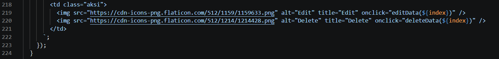

Analisis Bug : 
Script menggunakan link gambar yang tidak terdeteksi alamatnya sehingga browser tidak bisa mengambil gambar tersebut ikon hanya tampak sebagai kotak pecah atau tidak muncul sama sekali. Selain itu, ikon edit dan hapus tidak muncul karena  kode masih menggunakan placeholder {index} pada atribut onclick, yang seharusnya diganti dengan nomor urut data yang sesungguhnya, sehingga fungsi edit dan hapus tidak terhubung dengan data manapun.

Setelah perbaikan

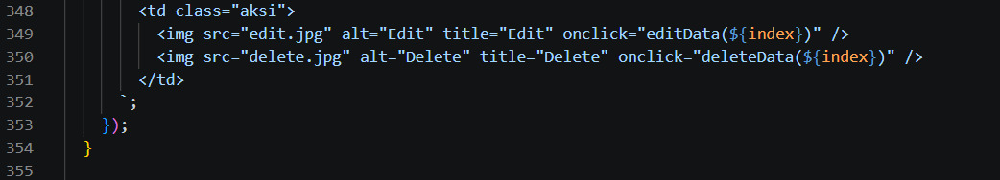
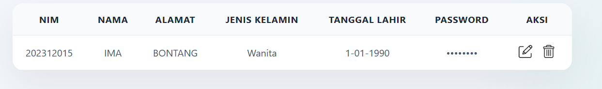

Analisis Perbaikan :
Perbaikannya dengan mengganti placeholder {index} menjadi variabel ${index} yang berisi indeks data yang benar, serta mengganti URL gambar online dengan file gambar lokal (edit.jpg dan delete.jpg) yang berada di folder yang sama, sehingga ikon edit dan hapus bisa muncul dengan baik dan fungsinya pun berjalan normal.

B. Code dan hasil awal bug 2

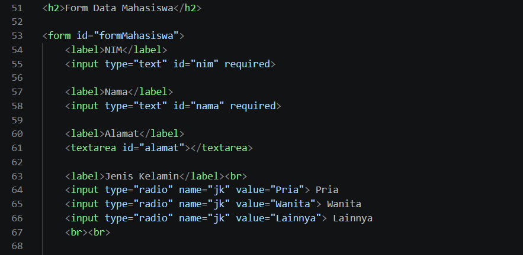
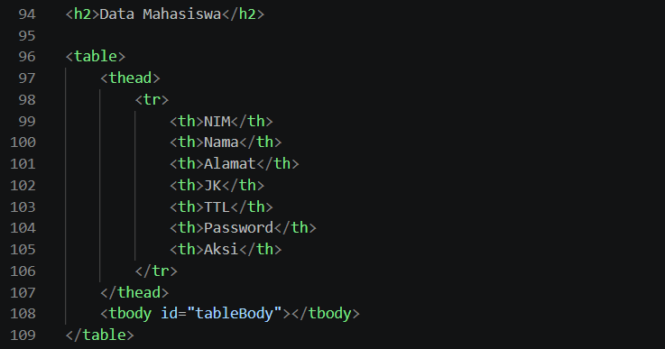
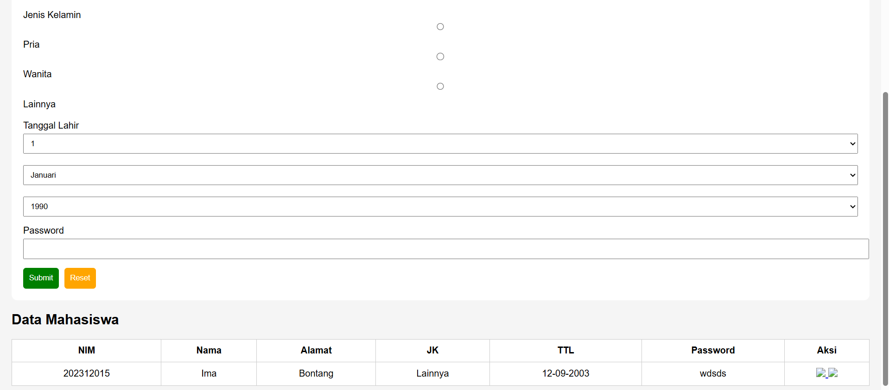

Analisis Bug:
Pada script awal, baris label di form yaitu <label>Jenis Kelamin</label>  menuliskan teks panjang "Jenis Kelamin" di form, namun pada baris tabel <th>JK</th> justru menuliskan singkatan "JK" untuk kolom yang sama, menyebabkan ketidaksesuaian istilah. Begitu juga dengan baris <label>Tanggal Lahir</label> di form, sementara di tabel pada baris <th>TTL</th> menggunakan singkatan "TTL", sehingga terjadi ketidaksesuaian karena istilah yang digunakan tidak konsisten. Selain itu, pada baris radio button <input type="radio" name="jk" value="Lainnya"> Lainnya, opsi "Lainnya" masih tersedia tanpa adanya validasi yang memaksa pengguna memilih salah satu. 

Setelah perbaikan

Analisi Perbaikan
Baris tabel diubah menjadi <th>Jenis Kelamin</th> dan <th>Tanggal Lahir</th> agar sama persis dengan label di form, sehingga data yang disajikan di form dan di tabel sama. Pada baris 
, radio button dibungkus agar rapi, dan opsi "Lainnya" dihilangkan dengan tidak menuliskan baris kode tersebut. Terakhir, ditambahkan baris 
Jenis Kelamin harus dipilih
 yang berfungsi menampilkan pesan peringatan jika pengguna belum memilih jenis kelamin, sehingga data yang masuk menjadi lebih lengkap dan valid. Dengan perubahan baris-baris kode ini, tampilan form dan tabel menjadi seragam, konsisten, dan lebih mudah dipahami pengguna.

C. Code dan hasil awal bug 3

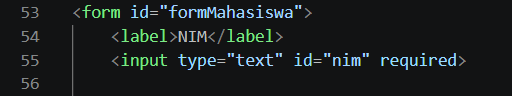
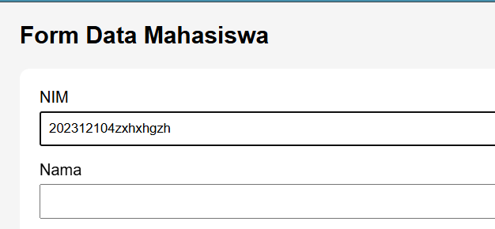

Analisis Bug
Pada script awal,baris kode <input type="text" id="nim" required> hanya menggunakan tipe input text biasa tanpa pembatasan karakter, sehingga kolom NIM dapat menerima huruf, simbol, atau campuran seperti terlihat pada hasil awal. Selain itu, tidak ada mekanisme validasi atau pesan error yang memberitahu pengguna bahwa NIM harus berupa angka. 

Setelah perbaikan

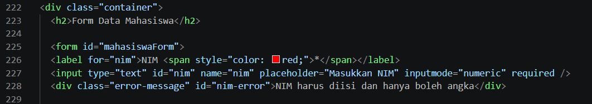
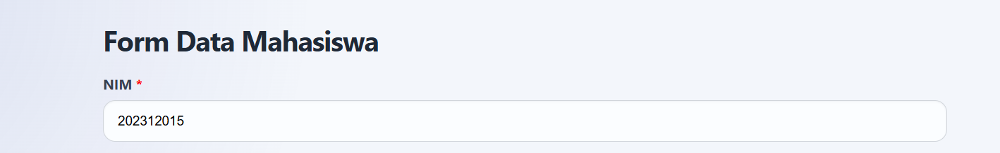

Analisi Perbaikan :
⦁ Baris <label for="nim">NIM</label> menambahkan atribut for yang menghubungkan label dengan input NIM sehingga lebih aksesibel. 
⦁	Baris <input type="text" id="nim" name="nim" placeholder="Masukkan NIM" inputmode="numeric" required /> menambahkan atribut inputmode="numeric" yang membuat keyboard numerik muncul di perangkat mobile, serta atribut name="nim" untuk memudahkan pengambilan data. 
⦁	Baris berikutnya, 
NIM harus diisi dan hanya boleh angka
 menambahkan tempat pesan error yang akan muncul jika pengguna memasukkan input tidak valid. 
⦁	Di bagian JavaScript, baris kode nimInput.addEventListener('input', function(e) { this.value = this.value.replace(/[^0-9]/g, ''); }); berfungsi memfilter setiap karakter yang diketik, secara otomatis menghapus semua karakter non-angka (huruf, simbol, spasi) sehingga hanya angka 0-9 yang tersisa. 
⦁	Baris nimInput.addEventListener('paste', function(e) { e.preventDefault(); const pastedText = (e.clipboardData || window.clipboardData).getData('text'); const numericOnly = pastedText.replace(/[^0-9]/g, ''); this.value = numericOnly; }); juga menangani kasus ketika user mem-paste teks dari clipboard, sehingga teks yang mengandung huruf atau simbol akan difilter dahulu menjadi hanya angka sebelum dimasukkan ke kolom NIM. 
⦁	Dengan perbaikan baris-baris kode tersebut, kolom NIM sekarang hanya bisa menerima data numerik murni seperti "202312015" dan secara otomatis menolak atau membersihkan karakter non-angka, serta memberikan notifikasi error jika pengguna mencoba memasukkan format yang salah.

D. Code dan hasil bug 4

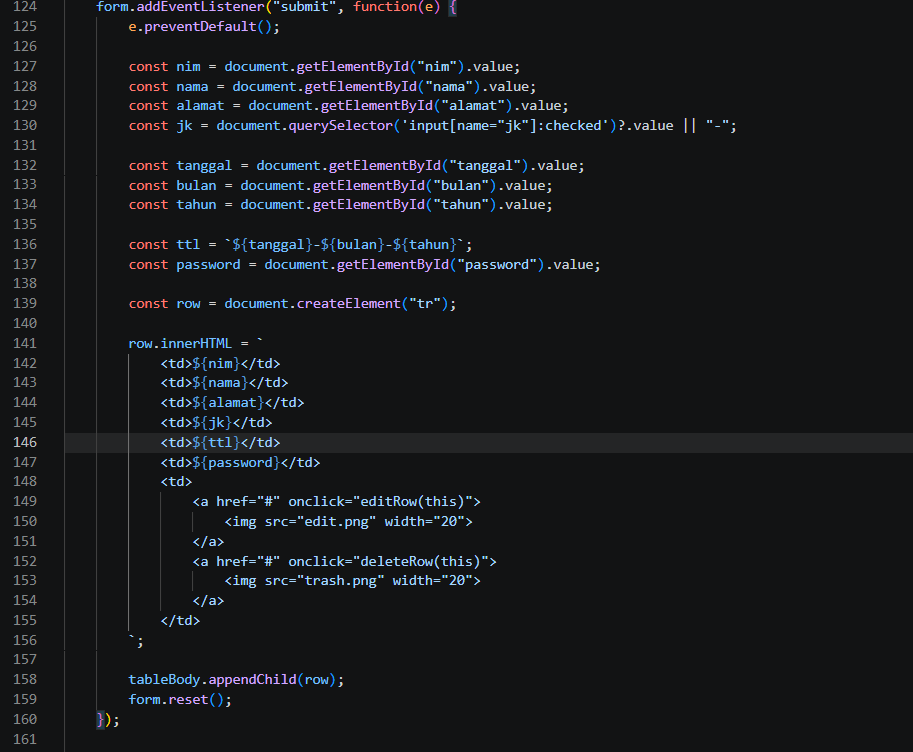
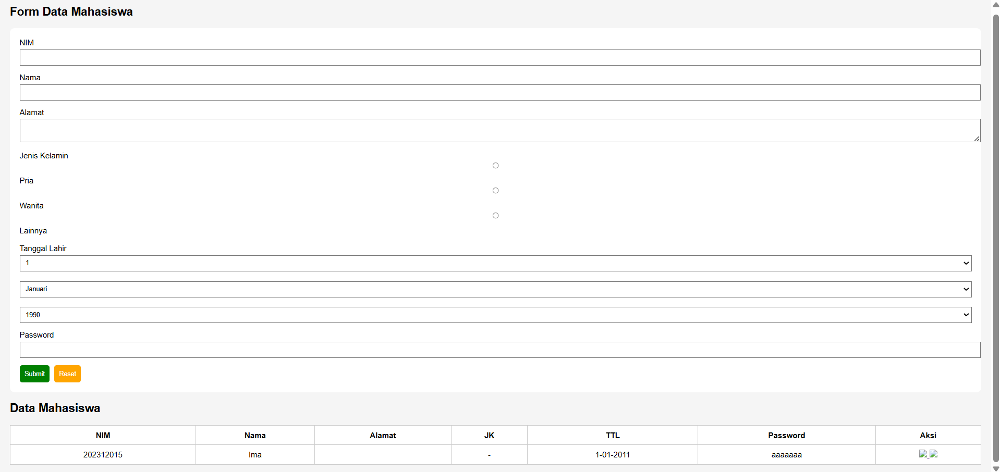

Setelah perbaikan

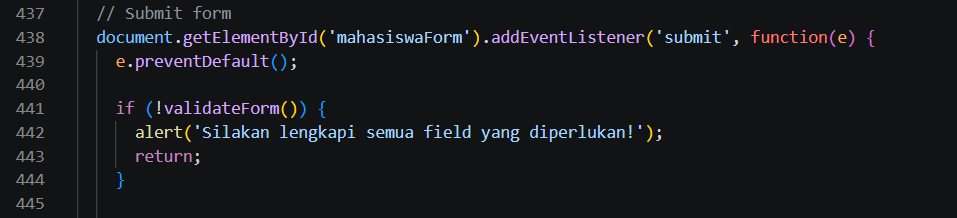
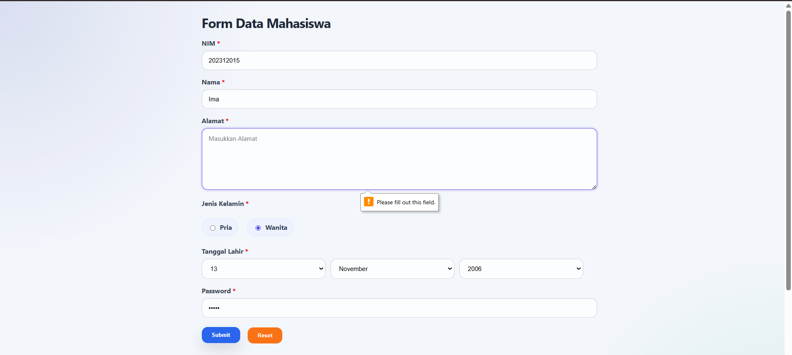

E. Code dan hasil bug 5

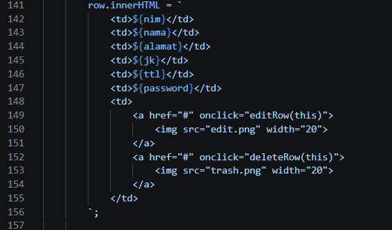
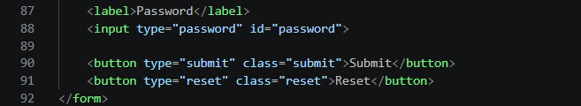
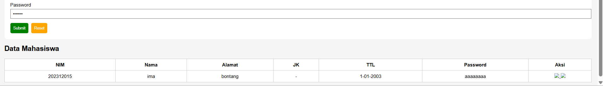 

Setelah perbaikan

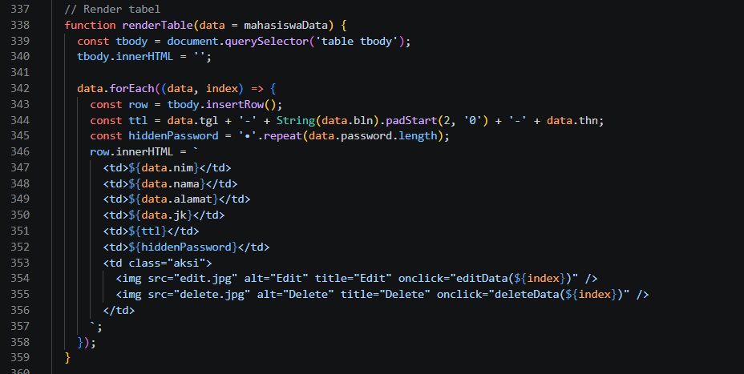
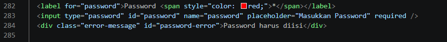
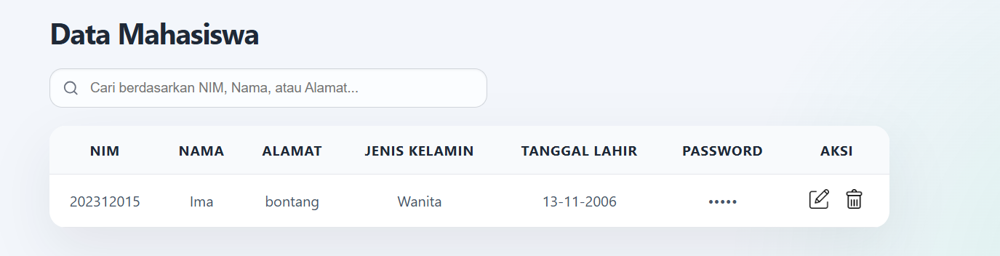

F. Code dan hasil bug 6

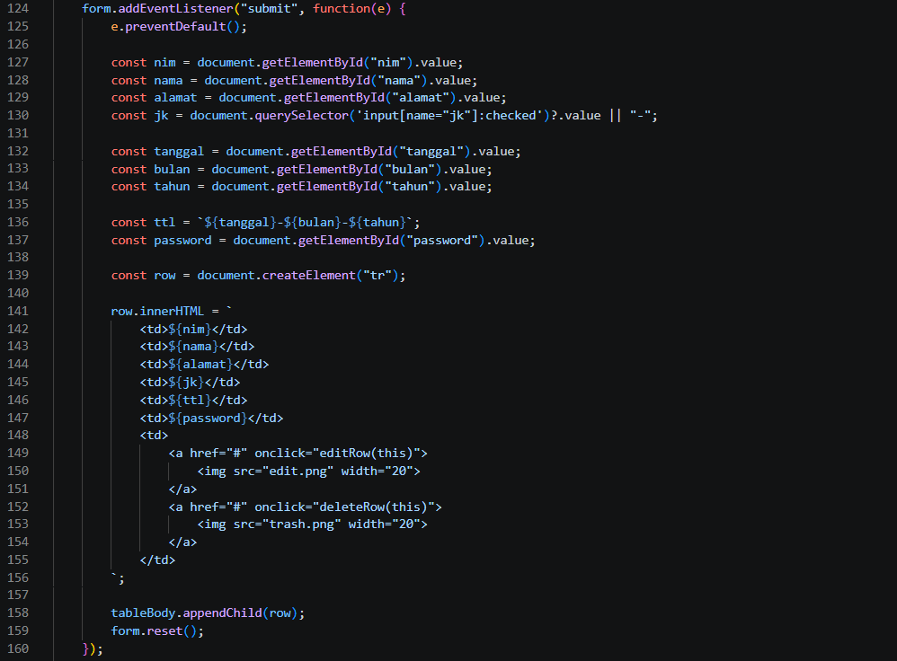
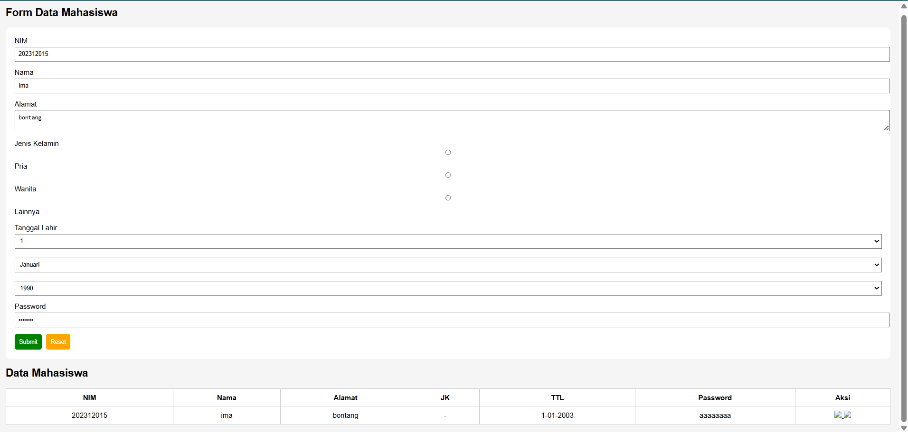
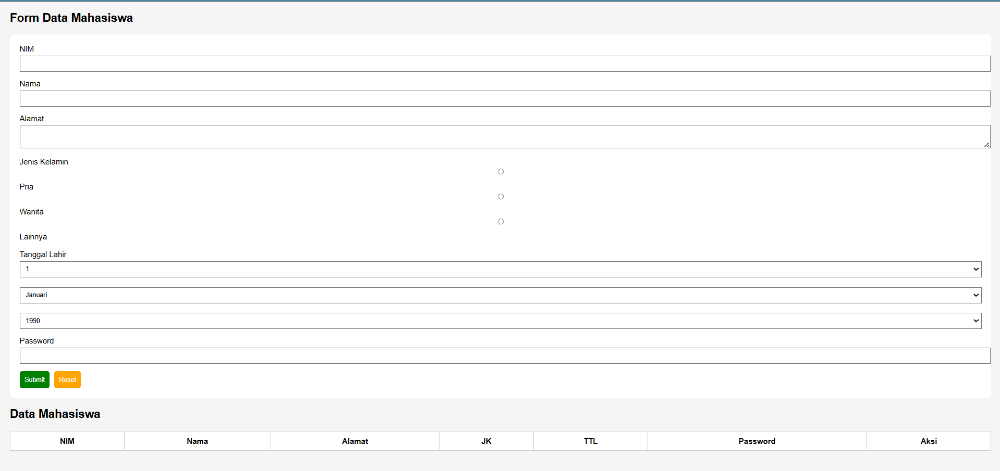

Setelah perbaikan

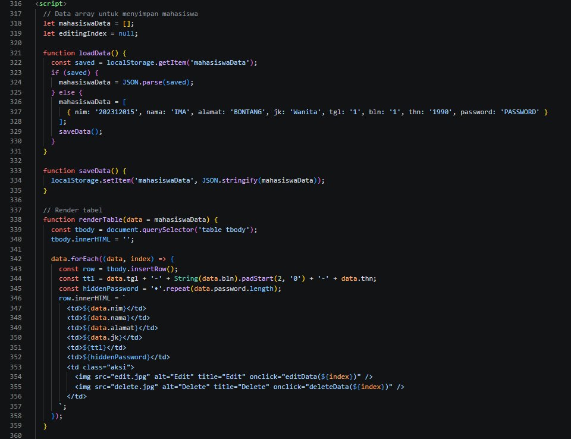
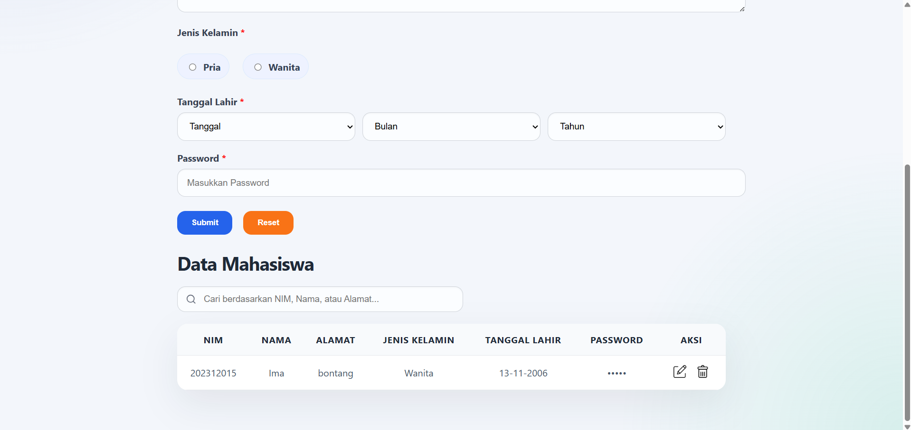
