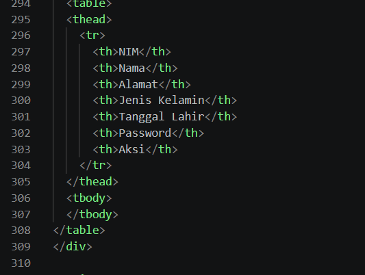
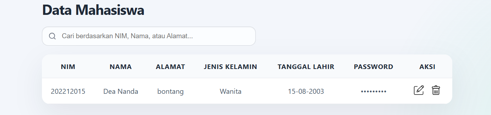

# Tugas-Pemrograman-Web-Kel-6-
Mencari, menganalisis dan melakukan perbaikan bug pada halaman web

Nama Kelompok : 
Nur Halimatul Sa'diah - 202312015
Danis Martanius - 202412035
Galang Surya Budi - 202412043

Code dan hasil awal bug 1

Setelah perbaikan

Code dan hasil awal bug 2

Setelah perbaikan

